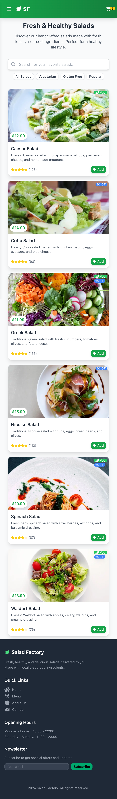
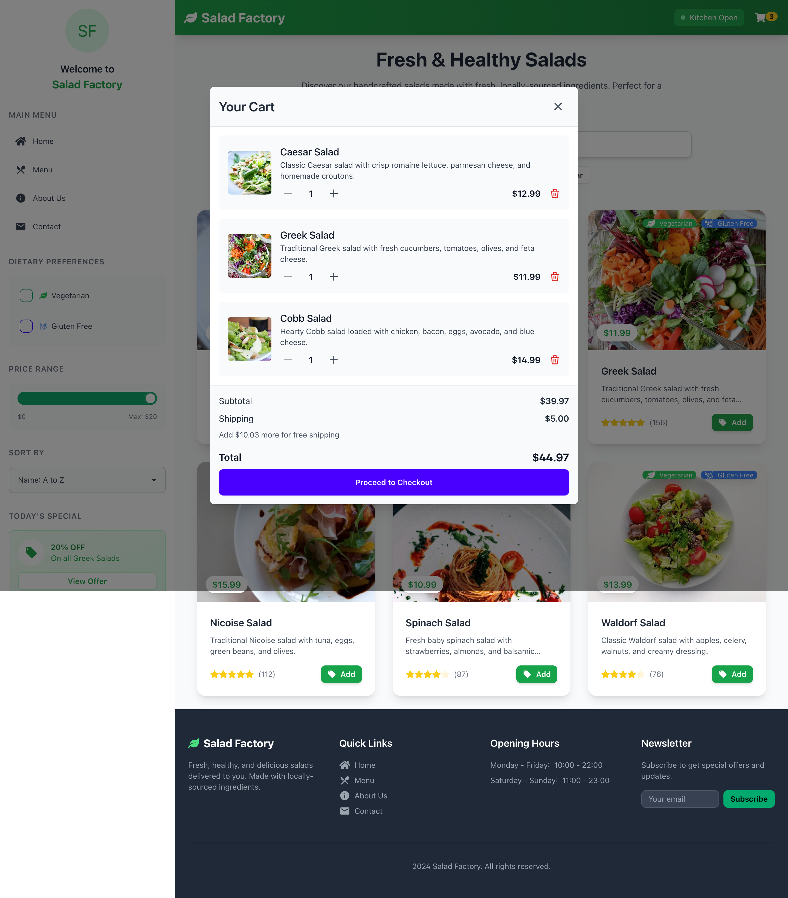

# Salad Factory Project

This is a [Next.js](https://nextjs.org) project for Salad Factory, bootstrapped with [`create-next-app`](https://nextjs.org/docs/app/api-reference/cli/create-next-app) and styled with [Tailwind CSS](https://tailwindcss.com/).

นี่คือโปรเจกต์ [Next.js](https://nextjs.org) สำหรับ Salad Factory ที่สร้างด้วย [`create-next-app`](https://nextjs.org/docs/app/api-reference/cli/create-next-app) และตกแต่งด้วย [Tailwind CSS](https://tailwindcss.com/)

## Live Demo

Check out our live demo at [https://next-taildwindcss-salad-factory-d1slba6wg-yongyuts-projects.vercel.app/](https://next-taildwindcss-salad-factory-d1slba6wg-yongyuts-projects.vercel.app/)

ลองชมเว็บไซต์ตัวอย่างของเราได้ที่ [https://next-taildwindcss-salad-factory-d1slba6wg-yongyuts-projects.vercel.app/](https://next-taildwindcss-salad-factory-d1slba6wg-yongyuts-projects.vercel.app/)

## Getting Started

To run the development server locally:

วิธีเริ่มต้นใช้งานเซิร์ฟเวอร์สำหรับการพัฒนาบนเครื่องของคุณ:

```bash
npm run dev
# or
yarn dev
# or
pnpm dev
# or
bun dev
```

Then, open [http://localhost:3000](http://localhost:3000) in your browser to see the result.

จากนั้นเปิด [http://localhost:3000](http://localhost:3000) ในเบราว์เซอร์ของคุณเพื่อดูผลลัพธ์

## Features

- 🥗 Customizable salad ordering system
- 🌿 Fresh ingredient selection
- 💨 Fast and responsive UI with Next.js and Tailwind CSS
- 📱 Mobile-friendly design

คุณสมบัติเด่น:
- 🥗 ระบบสั่งสลัดที่ปรับแต่งได้ตามใจชอบ
- 🌿 เลือกส่วนผสมที่สดใหม่ได้
- 💨 หน้าเว็บโหลดเร็วและใช้งานง่ายด้วย Next.js และ Tailwind CSS
- 📱 ออกแบบให้ใช้งานบนมือถือได้อย่างสะดวก

## Tech Stack

- [Next.js](https://nextjs.org/) - React framework for production
- [Tailwind CSS](https://tailwindcss.com/) - Utility-first CSS framework
- [React Icons](https://react-icons.github.io/react-icons/) - Popular icons in your React projects
- [DaisyUI](https://daisyui.com/) - Tailwind CSS component library

เทคโนโลยีที่ใช้:
- [Next.js](https://nextjs.org/) - เฟรมเวิร์ก React สำหรับการพัฒนาเว็บไซต์
- [Tailwind CSS](https://tailwindcss.com/) - เฟรมเวิร์ก CSS ที่ใช้คลาสสำเร็จรูป
- [React Icons](https://react-icons.github.io/react-icons/) - ไอคอนยอดนิยมสำหรับโปรเจกต์ React
- [DaisyUI](https://daisyui.com/) - ชุดคอมโพเนนต์สำเร็จรูปสำหรับ Tailwind CSS

## Screenshots

Here's a preview of our beautiful salad ordering website:


*Homepage with featured salads and customization options*


*Responsive mobile design for on-the-go ordering*


*Easy-to-use shopping cart with order summary*

ภาพตัวอย่างเว็บไซต์:


*หน้าแรกแสดงเมนูสลัดยอดนิยมและตัวเลือกการปรับแต่ง*


*ดีไซน์ที่ปรับให้เหมาะกับการใช้งานบนมือถือ*


*ตะกร้าสินค้าใช้งานง่ายพร้อมสรุปรายการสั่งซื้อ*

## Learn More

To learn more about the technologies used in this project:

- [Next.js Documentation](https://nextjs.org/docs) - learn about Next.js features and API.
- [Tailwind CSS Documentation](https://tailwindcss.com/docs) - explore Tailwind's utility-first approach.
- [React Icons Usage](https://react-icons.github.io/react-icons/) - how to use React Icons in your project.

เรียนรู้เพิ่มเติม:

หากต้องการศึกษาเพิ่มเติมเกี่ยวกับเทคโนโลยีที่ใช้ในโปรเจกต์นี้:

- [เอกสาร Next.js](https://nextjs.org/docs) - เรียนรู้เกี่ยวกับฟีเจอร์และ API ของ Next.js
- [เอกสาร Tailwind CSS](https://tailwindcss.com/docs) - ศึกษาวิธีการใช้งาน Tailwind แบบ utility-first
- [วิธีใช้ React Icons](https://react-icons.github.io/react-icons/) - วิธีนำ React Icons มาใช้ในโปรเจกต์ของคุณ

## Deployment

This project is deployed on [Vercel Platform](https://vercel.com/new?utm_medium=default-template&filter=next.js&utm_source=create-next-app&utm_campaign=create-next-app-readme), the creators of Next.js.

For more information on deploying Next.js apps, check out the [Next.js deployment documentation](https://nextjs.org/docs/app/building-your-application/deploying).

การนำไปใช้งานจริง:

โปรเจกต์นี้ถูกนำไปใช้งานบน [แพลตฟอร์ม Vercel](https://vercel.com/new?utm_medium=default-template&filter=next.js&utm_source=create-next-app&utm_campaign=create-next-app-readme) ซึ่งเป็นผู้สร้าง Next.js

สำหรับข้อมูลเพิ่มเติมเกี่ยวกับการนำแอป Next.js ไปใช้งานจริง ดูได้ที่ [เอกสารการ deploy ของ Next.js](https://nextjs.org/docs/app/building-your-application/deploying)

## Contribute

We welcome contributions to the Salad Factory project! Feel free to open issues or submit pull requests to help improve our online salad ordering experience.

ร่วมพัฒนากับเรา:

เรายินดีต้อนรับทุกการมีส่วนร่วมในโปรเจกต์ Salad Factory! คุณสามารถแจ้งปัญหาหรือส่ง pull requests เพื่อช่วยปรับปรุงประสบการณ์การสั่งสลัดออนไลน์ของเราให้ดียิ่งขึ้น
